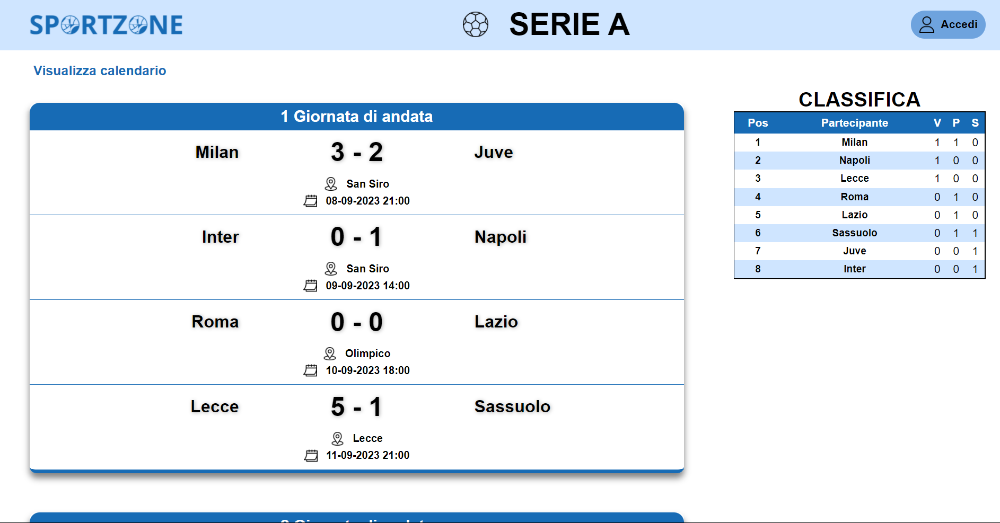
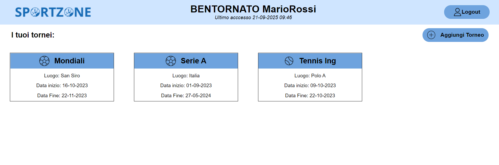

# SportZone

SportZone is an online platform designed to help users organize sports tournaments or view match results in a simple and intuitive way. Whether you're an organizer or a participant, SportZone provides the tools you need to manage tournaments efficiently.

**_Note: The entire project content is in Italian._**

## Screenshots

### Main Page


### Dashboard



## Features

### For Organizers:
- **Create Tournaments**: Easily create new tournaments from the main page by clicking the "Create Tournament" button.
- **Manage Tournaments**: After logging in, access the dashboard to view all your created tournaments. You can edit tournament details or add new ones.
- **Add Participants**: Use a form to add participants to your tournament. You can save participants and add more later if needed.
- **Schedule Matches**: Add match details, including dates and times, to your tournaments.
- **Record Results**: Enter match results after the scheduled date.

### For Visitors:
- **Search Tournaments**: Use the "Search Tournament" button on the main page to find tournaments from a list of available options.
- **View Tournament Details**: Access the tournament page to see results, rankings, and the schedule of upcoming matches.

## Installation

1. Clone the repository:
   ```bash
   git clone https://github.com/your-username/sportzone.git
   ```
2. Set up a local server (e.g., XAMPP)
3. Import the `sportzone.sql` file into your MySQL database.

## Acknowledgments
For more details, refer to the [User Manual](HTML/manuale.html).